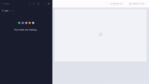
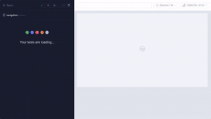
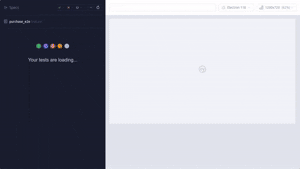

# Projeto Cypress - AutomationExercise

[](https://github.com/rfslusarz/automacao-testes-cypress/actions/workflows/ci.yml)


Framework de automação de testes E2E para o site https://www.automationexercise.com

## Stack

- JavaScript
- Cypress
- Cucumber (BDD) - @badeball/cypress-cucumber-preprocessor
- Allure - @shelex/cypress-allure-plugin
- Padrão Page Objects
- CI/CD com GitHub Actions

## Estrutura do Projeto

```
.
├── cypress/
│   ├── e2e/
│   │   ├── features/
│   │   │   ├── login.feature
│   │   │   ├── navigation.feature
│   │   │   ├── contact_us.feature
│   │   │   ├── purchase_e2e.feature
│   │   │   └── api/
│   │   │       └── trello_get_action.feature
│   │   └── step_definitions/
│   │       ├── common.steps.js
│   │       ├── login.steps.js
│   │       ├── navigation.steps.js
│   │       ├── contact_us.steps.js
│   │       ├── purchase_e2e.steps.js
│   │       └── api/
│   │           └── trello_get_action.steps.js
│   ├── fixtures/
│   │   ├── credentials.json
│   │   └── sample.txt
│   └── support/
│       ├── e2e.js
│       ├── commands.js
│       ├── api/
│       │   └── TrelloActionsClient.js
│       └── pages/
│           ├── HomePage.js
│           ├── LoginPage.js
│           ├── ProductsPage.js
│           ├── ProductDetailsPage.js
│           ├── CartPage.js
│           ├── CheckoutPage.js
│           └── ContactUsPage.js
├── .github/workflows/ci.yml
├── cypress.config.js
├── .cypress-cucumber-preprocessorrc.json
└── package.json
```

## Cenários de Teste

### Login

- Login válido e inválido
- Validação de campos vazios
- Email com formato inválido
- Mensagens de erro



### Navegação

- Produtos
- Categorias Women (Dress, Tops, Saree)
- Marca Madame
- Link Video Tutorials



### Contact Us

- Preenchimento do formulário
- Upload de arquivo
- Validação de sucesso

### Compra E2E

- Fluxo completo: produto, carrinho, login, checkout, pagamento



### API Trello

- GET Trello Actions API
- Validacao de status 200 e extracao de data.list.name

## CI/CD

O pipeline executa em:

- push para main/master
- pull_request para main/master

Etapas:

1. Checkout do codigo
2. Setup Node.js LTS
3. npm ci
4. Execucao de testes @e2e e @api (npm run test:ci)
5. Publicacao de artefatos: allure-results, screenshots, videos

## Pré-requisitos

- Node.js LTS (18 ou superior)
- npm 9+
Verifique as versões:
node -v
npm -v

## Instalação

git clone https://github.com/rfslusarz/projeto-cypress-hcxpert.git
cd projeto-cypress-hcxpert
npm ci

## Criando o projeto do zero (caso necessário)

Se for iniciar o projeto manualmente:

npm init -y
npm install --save-dev cypress

Para abrir o Cypress pela primeira vez:
npx cypress open

## Execução Local

### Modo interativo

```bash
npm run cy:open
```

### Modo headless (todos os testes)

```bash
npm run cy:run
```

### Execução por tags

```bash
npm run test:smoke      # @smoke
npm run test:login      # @login
npm run test:navigation # @navigation
npm run test:contact    # @contact
npm run test:e2e        # @e2e
npm run test:api        # @api - testes de API Trello
npm run test:ci         # @e2e or @api - suite executada no CI
```

Exemplo com expressão de tags:

```bash
npx cypress run --env tags='@login and not @ignore'
```

## Relatório Allure

### Gerar relatório

```bash
npm run allure:report
```

### Abrir relatório no navegador

```bash
npm run allure:open
```

A pasta `allure-results` é gerada durante a execução dos testes. O relatório é criado a partir desses resultados.

## Testes de API

O projeto inclui testes de API para o Trello Actions API. O teste valida o status code 200 e extrai o valor de `data.list.name`, registrando evidências no Allure (request, response body e valor extraído).

### Executar testes de API localmente

```bash
npm run test:api
```

### Executar suite do CI (@e2e + @api)

O CI executa apenas os testes de compra E2E e de API:

```bash
npm run test:ci
```

### Configuração da API

Variáveis de ambiente (Cypress env) com valores default:

- `trelloApiBaseUrl`: https://api.trello.com/1
- `trelloActionId`: 592f11060f95a3d3d46a987a

Parametrizar via linha de comando:

```bash
npx cypress run --env tags='@api' trelloActionId=OUTRO_ID trelloApiBaseUrl=https://api.trello.com/1
```

O pipeline falha se algum teste falhar.
